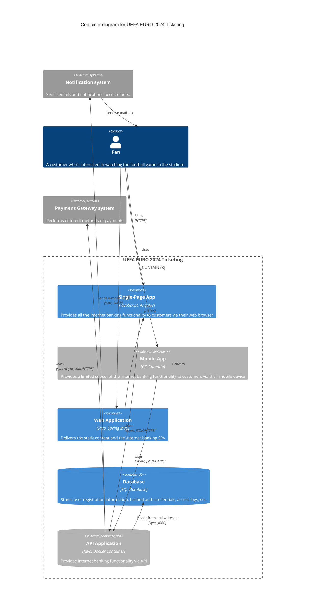

```mermaid
C4Container
    title Container diagram for UEFA EURO 2024 Ticketing

    System_Ext(notification_system, "Notification system", "Sends emails and notifications to customers.")
    Person(customer, "Fan", "A customer who's interested in watching the football game in the stadium.")

    Container_Boundary(c1, "UEFA EURO 2024 Ticketing") {
        Container(spa, "Single-Page App", "JavaScript, Angular", "Provides all the Internet banking functionality to customers via their web browser")
        Container_Ext(mobile_app, "Mobile App", "C#, Xamarin", "Provides a limited subset of the Internet banking functionality to customers via their mobile device")
        Container(web_app, "Web Application", "Java, Spring MVC", "Delivers the static content and the Internet banking SPA")
        ContainerDb(database, "Database", "SQL Database", "Stores user registration information, hashed auth credentials, access logs, etc.")
        ContainerDb_Ext(backend_api, "API Application", "Java, Docker Container", "Provides Internet banking functionality via API")
    }

    System_Ext(payment_gateway, "Payment Gateway system", "Performs different methods of payments")

    Rel(customer, web_app, "Uses", "HTTPS")
    UpdateRelStyle(customer, web_app, $offsetY="60", $offsetX="90")
    Rel(customer, spa, "Uses", "HTTPS")
    UpdateRelStyle(customer, spa, $offsetY="-40")
    Rel(customer, mobile_app, "Uses")
    UpdateRelStyle(customer, mobile_app, $offsetY="-30")

    Rel(web_app, spa, "Delivers")
    UpdateRelStyle(web_app, spa, $offsetX="130")
    Rel(spa, backend_api, "Uses", "async, JSON/HTTPS")
    Rel(mobile_app, backend_api, "Uses", "async, JSON/HTTPS")
    Rel_Back(database, backend_api, "Reads from and writes to", "sync, JDBC")

    Rel(notification_system, customer, "Sends e-mails to")
    UpdateRelStyle(notification_system, customer, $offsetX="-45")
    Rel(backend_api, notification_system, "Sends e-mails using", "sync, SMTP")
    UpdateRelStyle(backend_api, notification_system, $offsetY="-60")
    Rel(backend_api, payment_gateway, "Uses", "sync/async, XML/HTTPS")
    UpdateRelStyle(backend_api, payment_gateway, $offsetY="-50", $offsetX="-140")

```