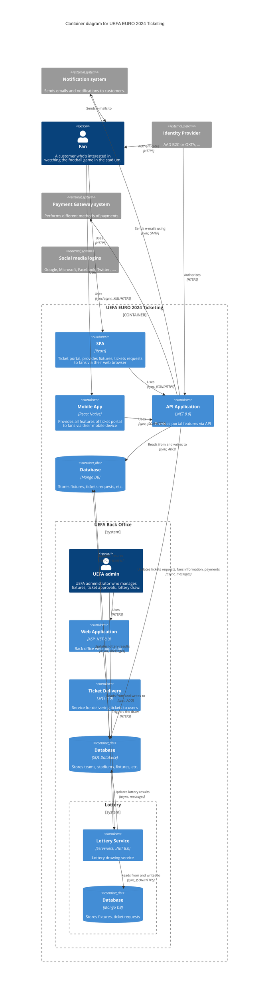

```mermaid
C4Container
    title Container diagram for UEFA EURO 2024 Ticketing

    System_Ext(notification_system, "Notification system", "Sends emails and notifications to customers.")
    Person(customer, "Fan", "A customer who's interested in <br /> watching the football game in the stadium.")

    Container_Boundary(c1, "UEFA EURO 2024 Ticketing") {
        Container(portal, "SPA", "React", "Ticket portal, provides fixtures, tickets requests <br /> to fans via their web browser")
        Container(mobile_app, "Mobile App", "React Native", "Provides all features of ticket portal <br /> to fans via their mobile device")
        Container(backend_api, "API Application", ".NET 8.0", "Provides portal features via API")

        ContainerDb(portal_db, "Database", "Mongo DB", "Stores fixtures, tickets requests, etc.")

        Boundary(c1_backoffice, "UEFA Back Office") {
            Person(uefa, "UEFA admin", "UEFA administrator who manages <br />fixtures, ticket approvals, lottery draw.")
            Container(backoffice, "Web Application", "ASP .NET 8.0", "Back office web application")
            Container(ticket_delivery, "Ticket Delivery", ".NET 8.0", "Service for delivering tickets to users")
            ContainerDb(backoffice_db, "Database", "SQL Database", "Stores teams, stadiums, fixtures, etc.")

            Boundary(c1_lottery, "Lottery") {
                Container(lottery, "Lottery Service", "Serverless, .NET 8.0", "Lottery drawing service")
                ContainerDb(lottery_db, "Database", "Mongo DB", "Stores fixtures, ticket requests")
            }
        }
    }

    System_Ext(idp, "Identity Provider", "AAD B2C or OKTA, ...")

    System_Ext(payment_gateway, "Payment Gateway system", "Performs different methods of payments")

    System_Ext(social_media, "Social media logins", "Google, Microsoft, Facebook, Twitter, ....")

    Rel(uefa, backoffice, "Uses", "HTTPS")
    UpdateRelStyle(uefa, backoffice, $offsetY="10", $offsetX="0")

    Rel(customer, portal, "Uses", "HTTPS")
    UpdateRelStyle(customer, portal, $offsetY="-40")

    Rel(customer, mobile_app, "Uses")
    UpdateRelStyle(customer, mobile_app, $offsetY="-30")

    Rel(idp, backend_api, "Authorizes", "HTTPS")
    UpdateRelStyle(idp, backend_api, $offsetY="10", $offsetX="0")

    Rel(idp, customer, "Authenticates", "HTTPS")

    Rel(backoffice, portal_db, "Updates fixtures", "async, messages")
    UpdateRelStyle(backoffice, portal_db)

    Rel(portal, backend_api, "Uses", "async, JSON/HTTPS")
    Rel(mobile_app, backend_api, "Uses", "sync, JSON/HTTPS")
    Rel(portal, backend_api, "Uses", "sync, JSON/HTTPS")
    Rel_Back(portal_db, backend_api, "Reads from and writes to", "sync, ADO")

    Rel_Back(backoffice_db, backoffice, "Reads from and writes to", "sync, ADO")

    Rel_Back(lottery_db, lottery, "Reads from and writes to", "sync, JSON/HTTPS")
    
    Rel(lottery, portal_db, "Updates lottery results", "async, messages")
    UpdateRelStyle(lottery, portal_db, $offsetY="-50", , $offsetX="-30")
    
    Rel(lottery, backoffice_db, "Updates lottery results", "async, messages")
    UpdateRelStyle(lottery, backoffice_db, $offsetY="-30")

    Rel(uefa, lottery, "Triggers the draw", "HTTPS")

    Rel(backend_api, backoffice_db, "Updates tickets requests, fans information, payments", "async, messages")
    UpdateRelStyle(backend_api, backoffice_db, $offsetY="-50", , $offsetX="-30")

    Rel(notification_system, customer, "Sends e-mails to")
    UpdateRelStyle(notification_system, customer, $offsetX="-45")

    Rel(backend_api, notification_system, "Sends e-mails using", "sync, SMTP")
    UpdateRelStyle(backend_api, notification_system, $offsetY="-60")

    Rel(backend_api, payment_gateway, "Uses", "sync/async, XML/HTTPS")
    UpdateRelStyle(backend_api, payment_gateway, $offsetY="-50", $offsetX="-140")
```
