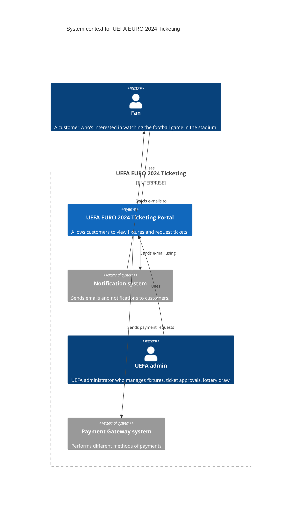

```mermaid
C4Context
    title System context for UEFA EURO 2024 Ticketing

    Person(customer, "Fan", "A customer who's interested in watching the football game in the stadium.")

    Enterprise_Boundary(c0, "UEFA EURO 2024 Ticketing") {
        System(ticketing_portal, "UEFA EURO 2024 Ticketing Portal", "Allows customers to view fixtures and request tickets.")
        
        System_Ext(notification_system, "Notification system", "Sends emails and notifications to customers.")

        Person(uefa, "UEFA admin", "UEFA administrator who manages fixtures, ticket approvals, lottery draw.")

        System_Ext(payment_gateway, "Payment Gateway system", "Performs different methods of payments")
    }

    Rel_D(customer, ticketing_portal, "Uses")
    Rel_Back(customer, notification_system, "Sends e-mails to")

    Rel_D(ticketing_portal, notification_system, "Sends e-mail using")
    Rel_R(ticketing_portal, payment_gateway, "Sends payment requests")

    Rel_D(uefa, ticketing_portal, "Uses")

    UpdateLayoutConfig($c4ShapeInRow="2", $c4BoundaryInRow="1")

```